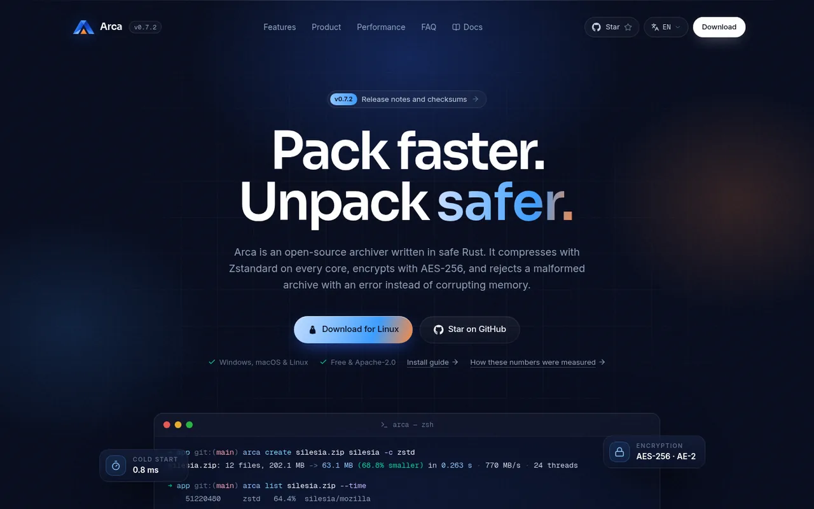
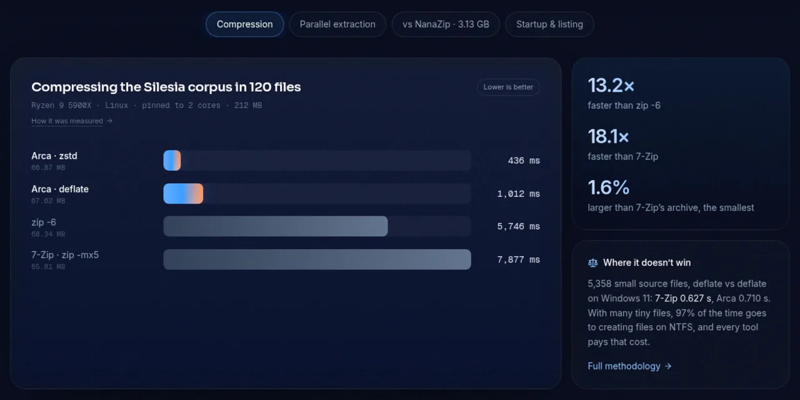

<div align="center">

<picture>
  <source media="(prefers-color-scheme: dark)" srcset="brand/arca-monolito-logotipo-blanco.svg">
  
</picture>

### Pack faster. Unpack safer.

A cross-platform archiver in Rust. ZIP and TAR, Zstandard on every core, AES-256, and parsers that can't corrupt memory.

[](https://github.com/beyondhumane/arca/actions/workflows/ci.yml) [](https://github.com/beyondhumane/arca/releases/latest) [](LICENSE) [](Cargo.toml)

**[Website](https://beyondhumane.github.io/arca/)** · **[Download](https://github.com/beyondhumane/arca/releases/latest)** · **[Guide](docs/guide/README.md)** · **[Guía en español](docs/guide/es/README.md)**

<br>



</div>

## At a glance

| Feature | Details |
|---|---|
| **Formats** | ZIP with Zip64 (store, Deflate, Zstandard), ustar TAR, `.tar.gz` |
| **Speed** | Multi-threaded compression, parallel `.zip` extraction, sub-millisecond start |
| **Safety** | `#![forbid(unsafe_code)]` parsers, bounded header reads, Zip Slip defence |
| **Encryption** | AES-256 (WinZip AE-2), opens in 7-Zip, WinRAR and NanaZip |
| **Interfaces** | `arca` command line, `arca-gui` desktop window, Windows 11 Explorer menu |
| **Platforms** | Windows, macOS (Apple silicon and Intel), Linux |

## Install

Grab the file for your platform from the **[latest release](https://github.com/beyondhumane/arca/releases/latest)** (Windows installer or portable zip, macOS and Linux tarballs), or build it:

```sh
cargo build --release          # binaries in target/release/
```

Details, checksums and the pure-Rust build are in [Installation](docs/guide/installation.md).

## Quick start

```sh
arca create photos.zip ~/Pictures/trip/    # format comes from the extension
arca list photos.zip                       # look inside, extract nothing
arca test photos.zip                       # verify every CRC, write nothing
arca extract photos.zip -o trip/           # unpack
```

More in the [Quick start](docs/guide/quick-start.md) and the [CLI reference](docs/guide/cli-reference.md).

## Performance

<div align="center">

</div>

Measured on one machine and reproducible with `bash bench.sh`. The [benchmarks](docs/guide/benchmarks.md) give the method, every run and where Arca loses.

## Documentation

<table>
<tr>
<td width="50%" valign="top">

**Use it**
- [Introduction](docs/guide/introduction.md)
- [Creating archives](docs/guide/creating-archives.md)
- [Listing & extracting](docs/guide/listing-extracting.md)
- [Encryption](docs/guide/encryption.md)
- [Desktop window](docs/guide/desktop-app.md) · [Shortcuts](docs/guide/keyboard-shortcuts.md)
- [Windows integration](docs/guide/windows-integration.md)

</td>
<td width="50%" valign="top">

**Under the hood**
- [Architecture](docs/guide/architecture.md)
- [Interoperability](docs/guide/interoperability.md)
- [Testing & benchmarking](docs/guide/testing-benchmarking.md)
- [Benchmarks](docs/guide/benchmarks.md)
- [Roadmap](docs/guide/roadmap.md)

</td>
</tr>
</table>

## Contributing

```sh
cargo test --workspace
bash interop.sh                # needs zip, unzip, tar and 7-Zip
```

Bug reports, benchmarks from your hardware and pull requests are welcome. Read [Contributing](docs/guide/contributing.md) first, and [open an issue](https://github.com/beyondhumane/arca/issues) for bugs.

## License

[Apache-2.0](LICENSE)
